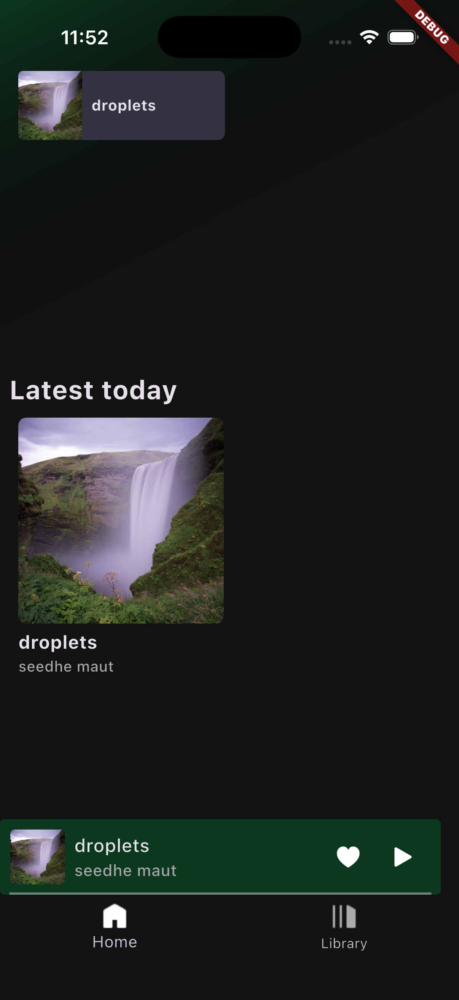
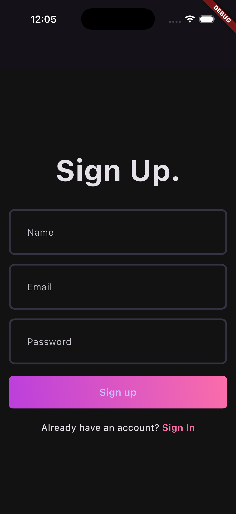
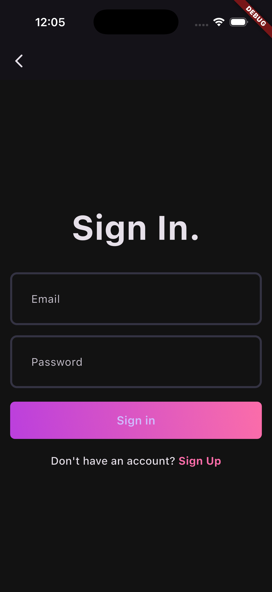
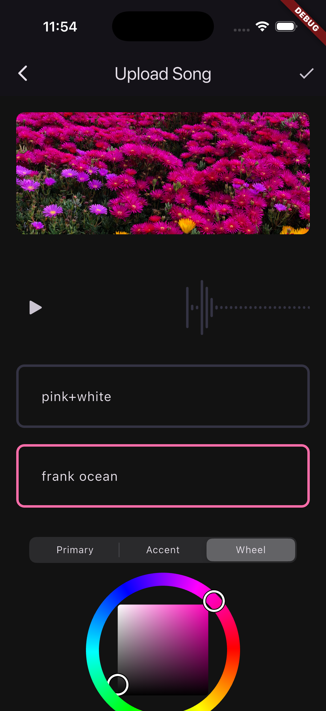
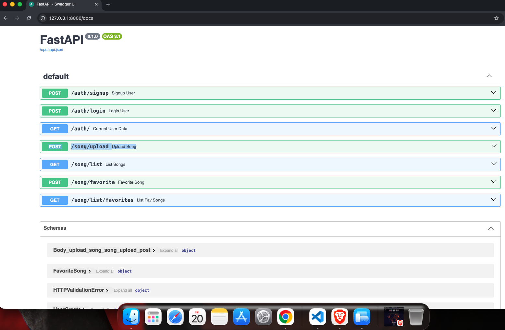
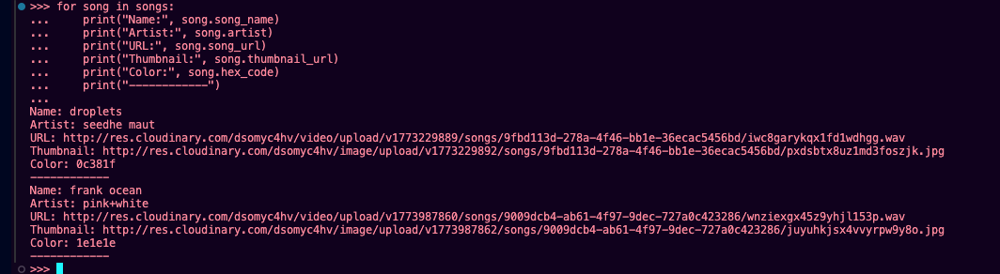

<div align="center">

# 🎧 Music Streaming App

**A full-stack music streaming application built with Flutter & FastAPI**

[](https://flutter.dev)
[](https://dart.dev)
[](https://fastapi.tiangolo.com)
[](https://python.org)
[](https://cloudinary.com)

</div>

---

## ✨ Features

| Feature | Description |
|--------|-------------|
| 🔐 **Authentication** | Secure user signup & login |
| 🎵 **Upload Songs** | Upload audio with title, artist & thumbnail |
| 📃 **Browse Library** | Explore all available tracks |
| ❤️ **Favorites** | Save songs to your personal collection |
| 🎧 **Music Player** | Interactive player with full playback controls |
| 🎨 **Dynamic Themes** | Per-song UI color customization |
| ☁️ **Cloud Storage** | Audio & images hosted on Cloudinary |

---

## 🏗️ Tech Stack

### 📱 Frontend
- **Flutter** — Cross-platform mobile UI framework
- **Dart** — Programming language

### ⚙️ Backend
- **FastAPI** — High-performance Python web framework
- **Python** — Backend language

### ☁️ Storage
- **Cloudinary** — Cloud-based media storage for audio & images

---

## 📱 App Preview

### 🏠 Home Screen


---

### 🔐 Authentication

<table>
  <tr>
    <td align="center"><b>Sign Up</b></td>
    <td align="center"><b>Sign In</b></td>
  </tr>
  <tr>
    <td></td>
    <td></td>
  </tr>
</table>

---

### 🎵 Upload Song


---

## ⚙️ Backend API



---

## 📊 API Response Data



> Displays song metadata including **title**, **artist**, **audio URL**, **thumbnail**, and **hex color** fetched from the backend API.

---

## 🧠 Architecture

```
┌─────────────────────┐
│   Flutter App (UI)  │
└────────┬────────────┘
         │ HTTP Requests
         ▼
┌─────────────────────┐
│  FastAPI Backend    │
└────────┬────────────┘
         │ Media Upload / Fetch
         ▼
┌─────────────────────┐
│ Cloudinary Storage  │
└─────────────────────┘
```

---

## 📂 Project Structure

```
music-app/
│
├── client/                   # Flutter App
│   ├── lib/                  # Dart source files
│   └── assets/
│       └── screenshots/      # App screenshots
│
├── server/                   # FastAPI Backend
│   └── main.py               # Entry point
│
├── requirements.txt
└── README.md
```

---

## 🛠️ Setup Instructions

### 1️⃣ Clone the Repository

```bash
git clone https://github.com/akankshacore/music-app.git
cd music-app
```

### 2️⃣ Backend Setup

```bash
cd server
pip install -r requirements.txt
uvicorn main:app --reload
```

> API will be running at `http://localhost:8000`  
> Swagger docs at `http://localhost:8000/docs`

### 3️⃣ Frontend Setup

```bash
cd client
flutter pub get
flutter run
```

---

## 💡 Future Improvements

- [ ] 🔍 Search functionality
- [ ] 🎶 Playlist support
- [ ] 🔊 Audio streaming optimization
- [ ] 📱 UI/UX enhancements
- [ ] 🌐 Web support via Flutter Web

---

## 👩‍💻 Author

**Akanksha**

---

<div align="center">

</div>
